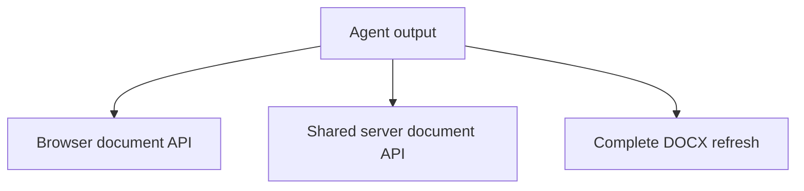

You can show agent updates in three ways. Choose based on where document edits execute and what your agent returns. Your model can run on a backend with any approach.

## 1. Edit the open document in the browser

Use `DocxEditor.createBrowser(editor)` from `@docx-editor.dev/editor-api/browser`. Connect the runtime to your existing editor, then execute validated agent tools through `runtime.run()`.

Tools use supported Office.js methods such as `search()`, `range.insertText()`, and `range.delete()`. Each completed `context.sync()` makes the edits visible. You do not need collaboration for this approach.

Your application receives the model stream and chooses when to commit. For a progressive draft, insert completed paragraphs. For existing content, apply targeted edits. The API does not consume raw token streams or incomplete tool arguments. Display partial output as progress until an operation is ready.

See [Runtime and setup](/docs/2.x/editor-api/runtime#drive-an-open-browser-editor) for the browser integration.

## 2. Edit a shared document from the server

Use `DocxEditor.createCollaborative(room.document, room.session)` when an agent and readers share a collaboration room. The worker joins the room and executes document API operations. The collaboration session distributes committed changes to connected clients.

Commit each completed operation to show progress in the document. Send job status through your application's transport. Keep room authorization, persistence, and job lifetime in your backend. Exported DOCX files are snapshots of the shared document; do not use them to replace an active room.

See [Collaboration](/docs/2.x/pro/collaboration#let-a-server-agent-propose-redlines) for setup and worker lifecycle.

## 3. Receive complete DOCX files

Use `createDocumentRefresh(editor)` when your agent or external processor returns a complete updated file. Call `capture()` before processing, then pass the returned DOCX bytes, submission, and sequence number to `refresh.applyUpdate()`.

The editor keeps its instance and preserves scroll by default. You can call `highlightChanges()` for temporary highlights or `navigateToChange()` to show a changed passage. Highlights require valid change locations or supported tracked revisions. They do not compare arbitrary files or create tracked changes.

Your application must receive or fetch each result; the editor does not watch a file URL. Each accepted replacement resets selection and undo history. Refresh refuses collaborative sessions. It also refuses a result if the document changed after `capture()`.

See [Document refresh API](/docs/2.x/guides/document-refresh#api-overview) for methods, options, and failure handling. Try its [interactive effects preview](/docs/2.x/guides/document-refresh#try-the-effects) to see scroll preservation, navigation, and fading highlights.

## Show edits as review suggestions

For API-driven text review, set `document.changeTrackingMode = 'TrackMineOnly'` and use ordinary range edits. Commit each completed suggestion separately so readers can review it while the agent continues.

Tracked edits require an author and support inline text within one paragraph, including table cells. Browser tracking also requires the Pro review module and an editable editor. Tracked structural edits and edits that touch pending revisions are unsupported. Tracking records the edits you submit; it does not turn a paragraph rewrite into smaller suggestions.

If a document changes after the agent reads it, handle `StaleDocument` by reading again and reconsidering the proposal. Do not replay the old edit automatically. Serialize agent operations. Use tool-call IDs to prevent duplicate execution, including calls that are still running.

The editing API and Pro review module require the EigenPal Pro License. See [Tracked changes](/docs/2.x/editor-api/revisions) for supported operations.

## Run the example

The [DOCX document refresh example](/examples/document-refresh) shows a mock server response, scroll preservation, change navigation, and temporary highlights. See its [source on GitHub](https://github.com/eigenpal/docx-editor/tree/main/examples/document-refresh). The example uses approach 3; it does not require a model API key.
